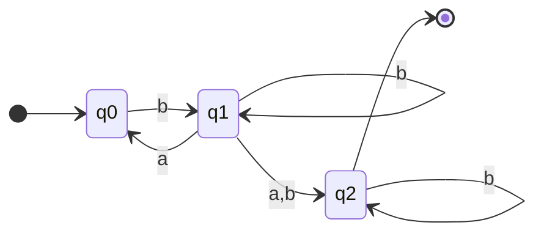
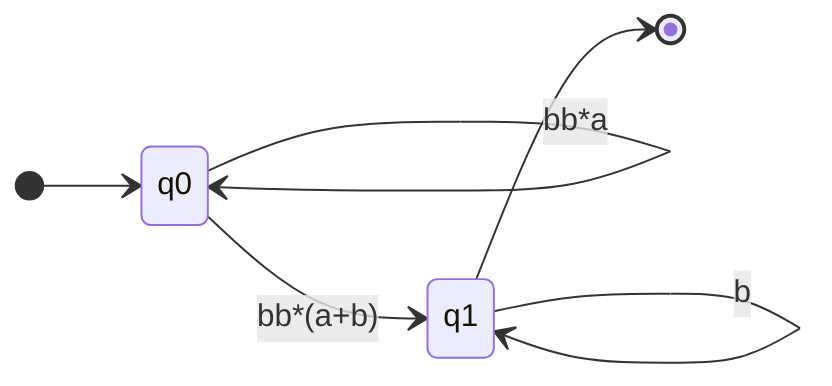

# Regular Expressions (RegEx) 

### Operations
- $r_1 + r_2$
- $r_1r_2$
- $r_1^*$
- $(r_1)$

### Generalized Transition Graphs (GTGs)
To convert a finite automata to a regular expression, we can use GTGs.

Example:
M = 

M = 

