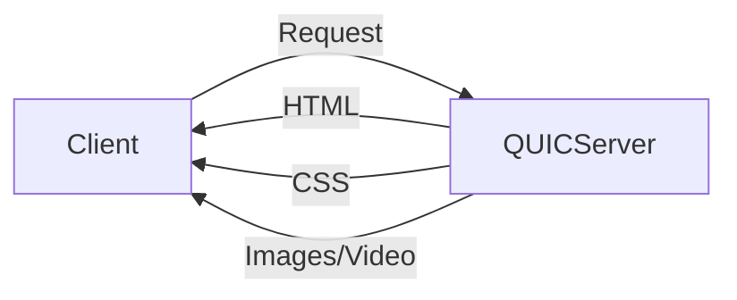

#### Tuesday, 12th September

## Notes
Look up: DASH Format

[[DASH]] (on [[QUIC]]) can be used with RTC to optimize streaming where there is only one sender and multiple receivers (e.g. a zoom session where only one can present and multiple can view passively).

**Note:** Read about [[Web RTC]]

##### HTTP/TCP or H3/QUIC
[[QUIC]] works over UDP. **Note: LOOK UP MORE INFO**
HTTP3 (H3) works over QUIC
[[QUIC]] solves the issue with *TCP slow starting*.
	TCP has congestion control.
	Starts growing $w$ (window) incrementally, until it reaches total capacity.
	
QUIC has congestion control -> look up.
	[[Apple HLS]] (HTTPS for Live Streaming): Apple's version of DASH. DASH cannot work on Apple devices.

##### HTTP/1.1 vs H2 vs H3
HTTP2 Push (K push): Pre-emptively pushes content on the assumption that it will be requested.

[[QUIC]] has two modes, one for the application layer (e.g. HTTP) and one for the transport layer (UDP).

[[TLS]] is a security layer (Transport Layer Security).
	Can latency be reduced if the security layer is removed? *Slides will be provided for this*.

##### QUIC vs TCP
**NOTE:** Look up [[RTT]]. 
Explore more about [[Multiplexing]].
	[[QUIC]] [[Multiplexing]] allows for simultaneous transmission over UDP.
		Example: From a QUIC server, the HTML files are sent on one stream, the CSS files on another, and tertiary files (e.g. images) are sent on a third. Therefore, if for example the HTML files are lost and needs to be retransmitted, it doesn't block the other streams.
		Note: This takes more bandwidth since you're sending the data in parallel.
*Connection migration* is very important for live streaming.
	e.g. switch from wifi to 5g: Transfer without executing new handshake, etc. QUIC does this transparently. It does this using a *64-bit session ID*, and therefore takes only a few milliseconds to re-establish a connection.
##### QUIC Features
HTTPS over QUIC uses 0-[[RTT]], meaning the announcement of the client and the transmission of the data happens at the same instant, therefore there is a starting latency of 0 ms.
	In contrast, TCP will require a 3-way h ]andshake, which will take time (e.g. 200 ms).

##### QoS / QoE
Quality of Service
	Objective, quantifiable performance of service.

Quality of Experience:
	Subjective user experience + Objective Metrics.
	Idea: priority based on experience (e.g. a larger screen might need lower bitrate compared to a big screen).

Measuring QoE: VMAF was designed by Netflix.

##### [[DASH]]
[[DASH]] is a format for HTTPS Adaptive Streaming ([[HTTPS Adaptive Streaming (HAS)]]).
In lecture slide diagrams, white cells are subjective to each company implementing it. Red - however - are fixed.

##### How to solve issue of competing clients over-utilization (Slide 29, 30)
- Adaptation algorithm like PANDA and BOLA
- ML Algorithms (Pensieve)
- Game/consensus theory (GTA) *Note: Look into this.*

#### Paper: A Buffer-Based Approach to Rate Adaption: Evidence from a Large Video Streaming Service
Issue: If buffer rate > bitrate, then might lead to buffer overflow, wasted buffering.
	However, if buffer rate < bitrate, frequent re-buffering.

#### Neural Adaptive Video Streaming with Pensieve
]
Look into  ([[Proximal Policy Optimization (PPO)]])
