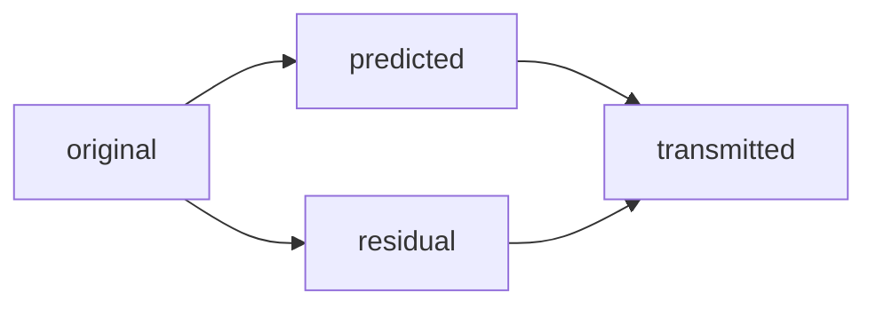

# Learned Video Compression
### An ML-based video encoding algorithm
#### Sahil Pattni (40216177)

---
## Traditional Codecs
### H.264

### H.265

### VP9

note: To explain what this paper does different, we need to see how traditional codecs like these handle compression.

---
## Frame types

1) Intra-coded frames (**I-frames**)
	+ compressed using an image codec.
	+ Does not depend on any other frames.
2) Predicted frames (**P-frames**)
	+ Extrapolated from past frames.
3) Bi-directional frames (**B-frames**)
	+ Interpolated from previously transmitted frames in both the past and future.
	+ Increases latency.

note:
Predicted: reconstructed.
Most of the magic is in predicted.

---
## Prediction Frames
Sending frame $x_t$ at time $t$... 

+ **Save bandwidth**: Compare parts of $x_t$ to similar parts in past reference frames.
+ **Motion Compensation**: Reconstruct image based on predicted movement.
+ **Residual**: Correct for prediction errors.

note: If not much changes between one frame and next, no need to send whole picture.

---
## General Encoder Architecture
![[pseudocode.png|500]]

---
## Prediction Frames
#### Traditional Approach
![[Step 1.png|600]]

---
## Motion Compensation
+ How can $x_1$ be shuffled to match $x_2$?
+ **Movement**: (Inverse) optical flow map $f_t$.

note:
- Only the arrangement of pixels changes.
- Horizontal & vertical displacements.

---
## Optical Flow Estimation

**INPUT:** $x_1,x_2 \in \mathbb{R}^{C \times H \times W}$

How can the pixels in $x_1$ be shuffled to match $x_2$?
<!-- element class="fragment" data-fragment-index="1" -->

**OUTPUT**: $f^* \in \mathbb{R}^{2 \times H \times W}$
<!-- element class="fragment" data-fragment-index="2" -->

$f^* = \min_f \mathscr{L}(x_2, F(x_1,f)) + \lambda \mathscr{R}(f)$
<!-- element class="fragment" data-fragment-index="3" -->

### $[F(x,f)]_{chw} = x_{c,\ h+f_{1hw},\ w+f_{2hw}}$
<!-- element class="fragment" data-fragment-index="4" -->

note: 
output is vertical and horizontal displacements.

L is a metric for similarity

R is for smoothness regularization

F is inverse optical flow operator

Lambda controls balance between the two

---
## H.265 Optical Flow Map
![[H.265 Optical Flow Map.png|500]]

---

## Motion Compensation
- **Movement**: (Inverse) optical flow map $f_t$.
+ **Save bandwidth**: Group similar areas into *blocks*.
	+ **Block-Matching**: A special case of optical flow estimation.
+ **Result**: Motion-compensated approximation $m_t$.

note:
- not every minute detail of what changed has to be transmitted: **blocks**.
---
## Prediction frames
- **Step 1:** Get motion compensated approximation ($m_t$).
+ **Step 2**: Compress the residual.

---
## Residual
What hasn't been captured by compression?
<!-- element class="fragment" data-fragment-index="0" -->

### $\Delta_t = x_t - m_t$
<!-- element class="fragment" data-fragment-index="1" -->

---
## Prediction Frames

---
## Prediction Frames
![[Step 1.png|500]]
+ $M(\cdot)$ is learnable flow estimator network $\rightarrow f_t \in \mathbb{R}^{2 \times H \times W}$
+ Auto-encoder for flow through a low-bandwidth bottleneck $\rightarrow \hat{f}_t$
+ Auto-encoding can be optimized by only considering $f_t - \hat{f}_t$
+ $m_t = F(\hat{x}_{t-1},\hat{f_t})$

---
## Prediction Frames
### Problems?
1) **Bandwidth distribution between motion and residual data.**

note:
- Every codec must decide.

---
## Prediction Frames
#### How to distribute bandwidth?
![[Step 1.png|600]]

note: 
- Every codec must decide how to best distribute bandwidth between flow and residual.
- Best ratio varies frame by frame.

---

## Prediction Frames
#### Idea: Compress jointly via the same bottleneck?

![[Step 2.png|600]]
+ Learns how to adapt bitrate distribution based on how complex a frame is.

note:
- varies frame by frame.

---
## Prediction Frames
### Problems?
1. Bandwidth distribution between motion and residual data.
	- Compress via the same bottleneck.
2) **Knowledge limited to optical flow maps and reference frames.**

note:
- All prior memory represented as previously reconstructed frame or the flow.
- Embedded in raw pixel space. Inefficient, Ineffective.
---
## Prediction Frames
#### Idea: Learnable state $S_t$
![[Step 3.png|650]]
+ $\geq 1$ tensor(s).
+ Let the model decide how to populate/update.

note:
- $S_t$ accumulates temporal information.
- $G(\cdot)$ is a module to compute frame-reconstruction $\hat{x}_t$ from $S_t$.

---
## Prediction Frames
### Problems?
1. Bandwidth distribution between motion and residual data.
	- Compress via the same bottleneck.
2. Knowledge limited to optical flow maps and reference frames.
	- Introduce generic, learnable state $S_t$.
3) **Purely motion-based translation.**

note:
- Compensation does not have to be limited to motion.
- Not just change the arrangement of pixels, but arbitrarily change their values.

---
## Prediction Frames

![[Train moving behind tree.png|400]]
I lost my pixels?
<!-- element class="fragment" data-fragment-index="1" -->

note:
- Occlusion patterns break the flow.
- Pixels disappear and then re-appear.

---
## Prediction Frames
#### Arbitrary Compensation
![[Step 3.png|650]]
+ $G(\cdot)$ can be generalized to generate multiple flows and reference frames.
+ Preserves occlusions.

note:
- Decompose a complex scene into multiple simple flows.
---
## Prediction Frames
### Problems?
1. Bandwidth distribution between motion and residual data.
	- Compress via the same bottleneck.
2. Knowledge limited to optical flow maps and reference frames.
	- Introduce generic, learnable state $S_t$.
3. Purely motion-based translation.
	1. Decompose into *multiple* flows.
4) **Block matching:**
	+ Aggregated motion.
	+ quantized to specific sub-pixel resolution (e.g. $\frac{1}{2}$, $\frac{1}{4}$, $\frac{1}{8}$)

note:
- person walking left to right, turning head sideways.
- Simple and cannot represent a wide range of information.
- pixels in a block are assumed to have the same motion.
- pixels can only take steps in specific increments (e.g. $\frac{1}{2}$, $\frac{1}{4}$, $\frac{1}{8}$)

---
## Prediction Frames

![[Optical Flow Maps - Dual.png|500]]
+ **Remember:** We can bandwidth depending on frame complexity.
+ Arbitrary pixel resolution for flow map.

---
## Main Contributions
- Generalizes motion estimation to perform learned compensation beyond simple translations.
- Maintains a state of arbitrary information learned by the model (instead of strictly relying on previously transmitted frames).
- Enables jointly compressing all transmitted signals (such as optical flow and residual).
- Designed for low-latency environments where each frame can only rely on past information.

note:
Novel architecture for video compression.

---

## Comparison
![[Reconstruction 1.png|400]]

---
## Comparison
![[Reconstruction 2.png|400]]

---

## Coding Procedure
- After auto-encoding, we have a fixed-size tensor $c \in [-1,1]^{C \times Y \times X}$
+ **Goal:** map $c$ to $e \in {0,1}^{\ell(e)}$
+ Achieve a high efficiency by exploiting redundancy injected into $c$ by $\mathscr{R}$.

---

## Bitplane Decomposition
+ Transform $c$ into a binary tensor $b \in {0,1}^{B \times C \times Y \times X}$ by decomposing it into $B$ bitplanes.
+ Maps each value $c_{chw}$ into its binary expansion $b_{1chw},\cdots,b_{Bchw}$ of $B$ bits.
+ Lossy operation.
+ $B=6$

note:
- Lossy since the precision of each value is truncated.
- B=6 used in practice.

---
## Adaptive Entropy Coding (AEC)
+ Maps binary tensor $b$ into bitstream $e$. 
+ $\forall b_{bcyx} \in b:\ \mathbb{P}[b_{bcyx} = 1 \vert C \ ]$
+ Leverage the structure and patterns in the data to represent it with fewer bits.

note:
- Train a classifier to predict the activation of each bit $b_{bcyx}$ by considering the bits it has seen before ($C$ is the context).

---
## Adaptive Code-length Regularization
+ Regularizer reduces entropy of $b$.
+ Lower entropy = more predictable patterns.
+ Distributes bits in a code-layer ($\hat{c}$) to be increasingly sparse as it iterates through the bitplanes.

$\mathscr{R}(\hat{c}) = \frac{\alpha_i}{CYX} \displaystyle\sum_{cyx}^{} log \vert \hat{c}_{cyx} \vert$
<!-- element class="fragment" data-fragment-index="4" -->

$\mathbb{E}_{\hat{c}} = [ \ell(e) ] \rightarrow \ell^{\text{target}}$

<!-- element class="fragment" data-fragment-index="6" -->

note:
- More predictable patterns allows for more efficient compression.
- Adjust scalar $\alpha_i$ to get the average code-length to match target.
- Do this by being more/less aggressive in reducing entropy.